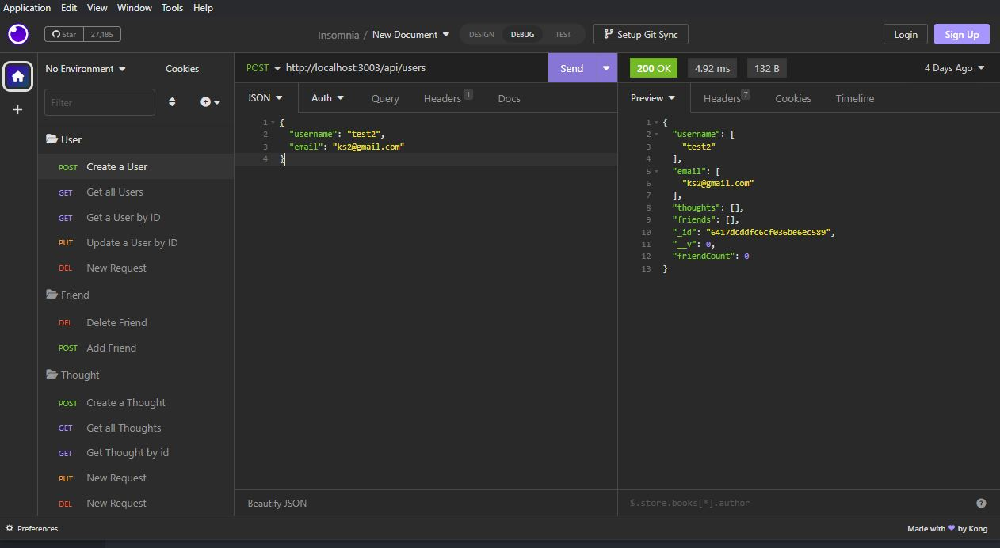

# Social Network API

## Description

This page will serve as an API for a social network page. It will contain all the back-end code that links and creates Users, thoughts and reactions.

## Table of contents

-[Installation](#Installation)

-[Usage](#Usage)

-[Credits](#Credits)

## Installation

This page shows the coding repository: https://github.com/KobyS82/Social-Network-API

## Usage

This page can be viewed by installing the modules (npm install), running the seeds (npm run seed), and running the routes in Insomnia. 
Here is a link to the video walkthrough: 
https://drive.google.com/file/d/12q24QNH9mI2nG4HJRbcn3PcuKf_rwu0j/view

 

## Credits

Janey, for route fixing, https://github.com/jbtiglao/social-media-API/blob/main/routes/api/thought-routes.js

GitHubUser 94569484, for Insomnia routes, https://user-images.githubusercontent.com/94569484/167376248-b824a670-d62a-49bc-b1f1-b6d3c8836e5c.png

